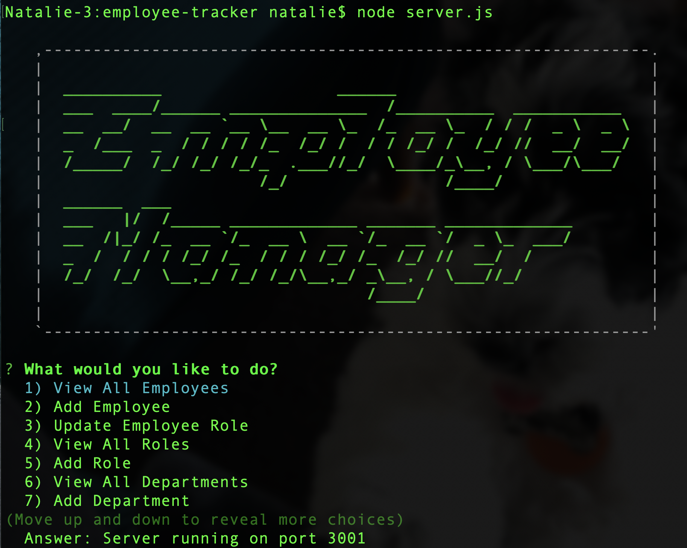

## Employee Tracker - Week 12 Homework

## Description

Sometimes developers have to create interfaces that allow non-developers an accessible way to interact with information that has been stored in a database. I was tasked to create an command-line application that could manage an employee database housed in mySQL. The application was to use Node.js, Inquirer, and MySQL.

## Table of Contents

- [User Story](#user-story)
- [Acceptance Criteria](#acceptance-criteria)
- [Database Creation](#database-creation)
- [Initial Question](#initial-question)
- [Array Building](#array-building)
- [User Options](#user-options)
- [License](#license)
- [Link](#link)

## User Story

```md
AS A business owner
I WANT to be able to view and manage the departments, roles, and employees in my company
SO THAT I can organize and plan my business
```

## Acceptance Criteria

```md
GIVEN a command-line application that accepts user input
WHEN I start the application
THEN I am presented with the following options: view all departments, view all roles, view all employees, add a department, add a role, add an employee, and update an employee role
WHEN I choose to view all departments
THEN I am presented with a formatted table showing department names and department ids
WHEN I choose to view all roles
THEN I am presented with the job title, role id, the department that role belongs to, and the salary for that role
WHEN I choose to view all employees
THEN I am presented with a formatted table showing employee data, including employee ids, first names, last names, job titles, departments, salaries, and managers that the employees report to
WHEN I choose to add a department
THEN I am prompted to enter the name of the department and that department is added to the database
WHEN I choose to add a role
THEN I am prompted to enter the name, salary, and department for the role and that role is added to the database
WHEN I choose to add an employee
THEN I am prompted to enter the employee’s first name, last name, role, and manager, and that employee is added to the database
WHEN I choose to update an employee role
THEN I am prompted to select an employee to update and their new role and this information is updated in the database
```

## Database Creation

To create the initial database I created a "db" folder that houses the schema.sql and seeds.sql files. The schema.sql creates three different tables - department, role, employee - based on the following outline:


The seeds.sql file then fills in each of the three tables with some preliminary data to work with development and for example purposes.

## Initial Question

Order to start the application, I created the initial function that would handle the list of options for the user based on the acceptance criteria, as well as a few extra options including:

- View All Employees
- Add Employee
- Update Employee Role
- View All Roles
- Add Role
- View All Departments
- Add Departments
- Update Employee Manager
- View Employees By Manager
- Delete an Employee
- Quit

This function is called, initially, in the server file to begin the employee management system. It is then called again at the end of each option function to present the options again after a finished request unless the user selects "Quit".

## Array Building

All the mySQL queries that may need to run to create the arrays necessary for certain user requests were all compiled into a single file in the "lib" folder. These functions were written such that they returned a promise so that they could be used in async/await to ensure that all the database queries were completed prior to other inquirer functions.

## User Options

All of the functions called in the "Initial Question" function were compiled into a single file in the "lib" folder. Each function that handles a "view" request from the user queries the database and displays the selected data using the console.table package to improve the visual representation. Each function that handles an add, update, or delete, gathers the necessary arrays from the database queries and then asks the user for the information required to complete the request. Once the data has been gathered, the function using one of the CRUD queries to add to, update, or deleted from the employee_db database.

## License

[](https://opensource.org/licenses/MIT)

This project is protected under the MIT License.

## Link

See the following for a link to the walkthrough video of the application: https://youtu.be/3xTIREtTkSY

Screenshot of "Home" Screen


